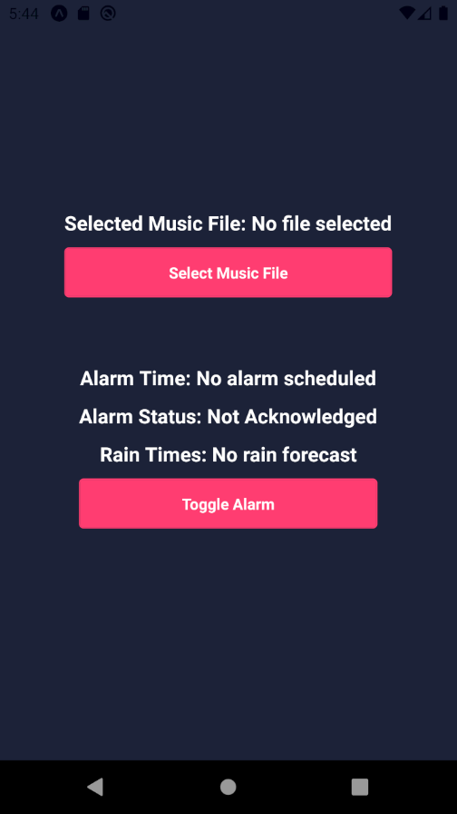

# Rain Alarm App

## Description

The Rain Alarm App is a weather-based alarm system that alerts users when it's going to rain. The app uses weather data to forecast rain and schedules an alarm to notify the user. I created it to remind me to get the dog inside before it rains, so I don't have to shower him.





## Features

- Fetches weather data to predict rain.
- Schedules an alarm based on the rain forecast.
- Allows users to acknowledge the alarm.
- Users can select a music file to play when the alarm goes off.

## How to Use

1. The app fetches weather data from a weather API.
2. It checks the forecast for any upcoming rain.
3. If rain is forecasted, it schedules an alarm to alert the user.
4. The user can acknowledge the alarm to stop it from going off.
5. Users can also select a music file to play when the alarm goes off.

## Installation

To install the app, clone the repository and install the dependencies:

```
git clone https://github.com/felopater-melika/rainalarm.git
cd rainalarm
npm install
```

Then, start the app:

```
npm start
```